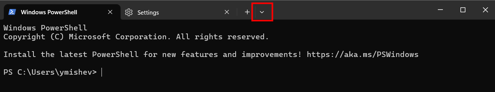
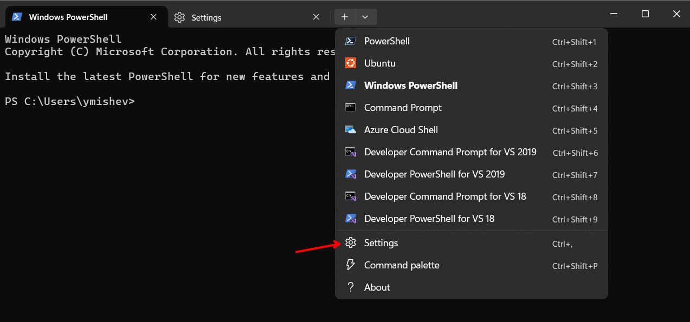
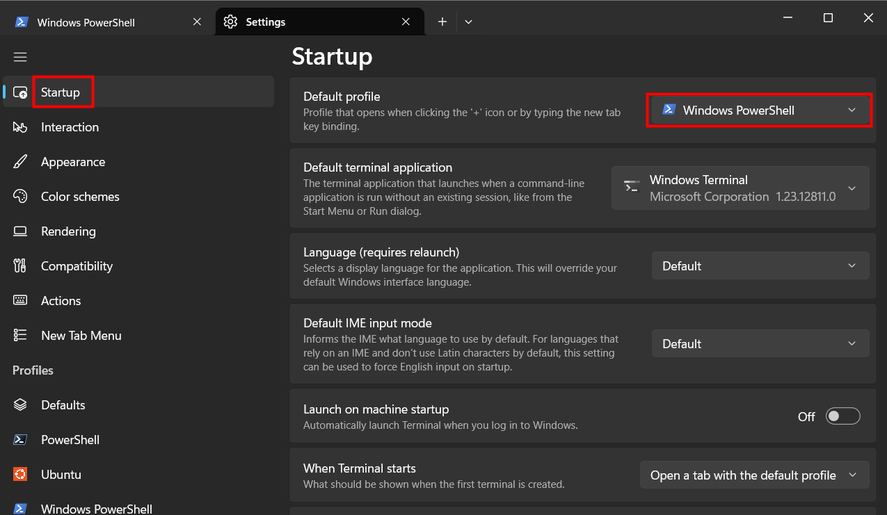
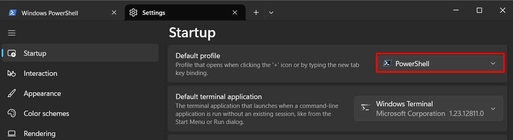
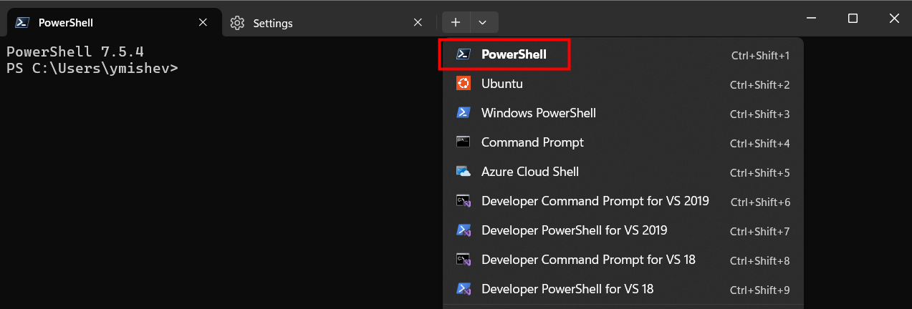
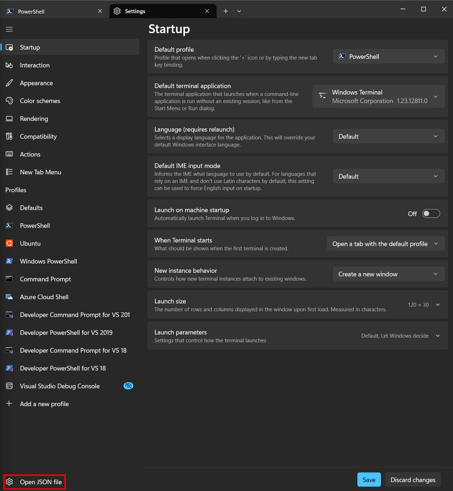
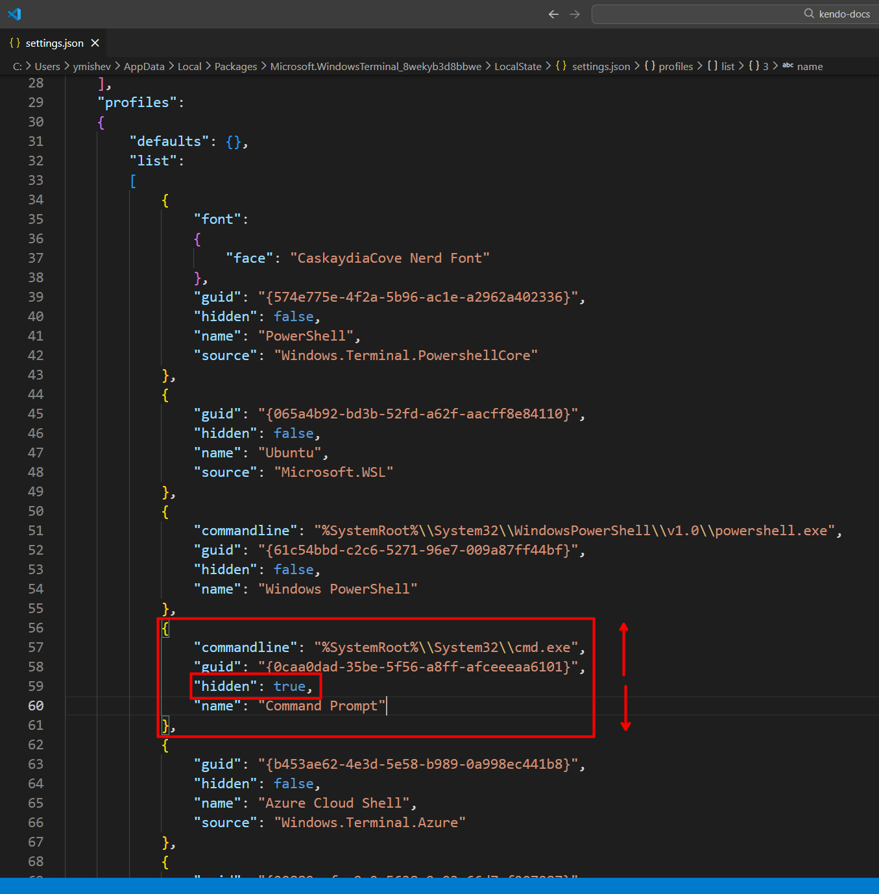

# Terminal vs Shell

A **terminal** and a **shell** are two distinct components of a command-line interface, often used interchangeably but serving different purposes. Think of a terminal as the physical or virtual interface that allows you to interact with your computer, while the shell is the program that processes your commands within that interface. You can use the terminal to access the shell, which then interprets and executes your commands. Use the terminal as your main entry point to the command line, and the shell as the tool that carries out your instructions.

There are different types of shells, such as Bash, Zsh, and Fish, each with its own features and capabilities. The terminal can be a command prompt in Windows, Terminal.app on macOS, or various terminal emulators on Linux like GNOME Terminal or Konsole.

This YT video provides a clear explanation of the difference between a terminal and a shell: [Terminals and Shells Explained](https://youtu.be/QKBcHuA3VJE?si=0G0GBaEZJdR5Jnda).

- batch files: .bat or .cmd files used in Windows to execute a series of commands. Used also to setup aliases and environment variables.

# Terminal settings and setup

## Default shell in Windows Terminal

By default you will have Windows PowerShell, CommandPrompt and Azure CLI installed but you can always add more terminals like Git Bash, Windows Subsystem for Linux (WSL), etc. For instance we can download Powershell from the windows store to get the latest version.

To change the default terminal to the latest PowerShell:
1. Open Windows Terminal.
2. Click on the down arrow next to the plus (+) tab button.

3. Select "Settings" from the dropdown menu.

4. Startup > Default profile, select PowerShell.

5. Save and open an new terminal to reflect the changes.

Now every new terminal you open will be PowerShell by default and in the dropdown PowerShell will be bolded to indicate it's the default terminal.

## Reordeing the terminal profiles

To reorder the terminal profiles in Windows Terminal you can edin the `settings.json` file directly by setting the `"hidden"` property to `true` or `false` for each profile and/or by switching the order of the profiles in the `"profiles"` array.

1. Open settings and open the json file by clicking on the "Open JSON file" button at the bottom left.

2. In the `"profiles"` array, locate the profiles you want to reorder or hide/expose.

In this example I have hidden the Command prompt.